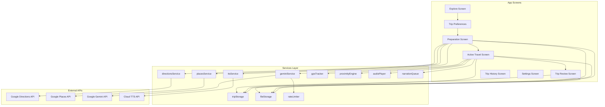
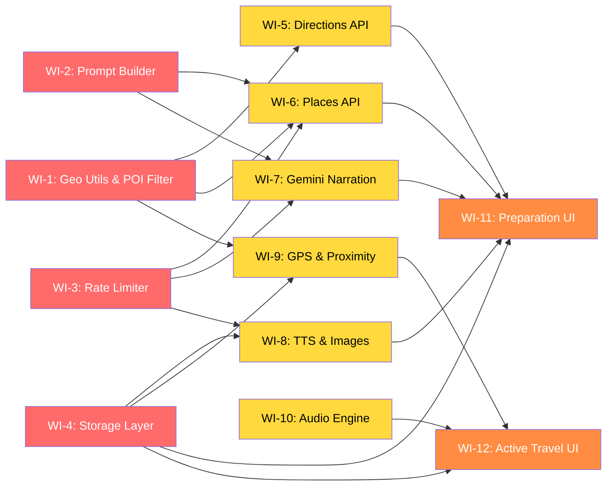

# Travel Companion App — Dev Plan & Work Items

> This document breaks the implementation plan into **12 independent work items** that can be assigned to junior engineers in parallel. Each work item is self-contained with full context, file locations, acceptance criteria, and dependencies.

---

## Project Overview

An Expo (React Native) travel companion app that:
1. **Pre-Travel (Online)**: Lets you select a destination or route → fetches POIs → generates rich narrations via Gemini → pre-generates audio via Cloud TTS → caches everything locally
2. **Active Travel (Offline)**: Tracks GPS → triggers narrations by proximity → plays audio → logs the trip
3. **Post-Travel**: Trip history, replay, bookmarks

**Tech Stack**: Expo SDK 56, TypeScript, expo-sqlite, expo-router, Google APIs (Places, Directions, Gemini), Cloud TTS (Google/ElevenLabs)

**Project Root**: `/Users/cucco/Documents/travle-companion`

---

## Architecture Diagram



---

## Data Model (Key Types)

All types are defined in `src/types/`. Engineers should reference these when implementing their work items.

| Type | File | Purpose |
|------|------|---------|
| `POI` | [poi.ts](file:///Users/cucco/Documents/travle-companion/src/types/poi.ts) | 14-field enriched POI model |
| `Trip` | [trip.ts](file:///Users/cucco/Documents/travle-companion/src/types/trip.ts) | Trip with mode, preferences, POIs, status |
| `TripPreferences` | [trip.ts](file:///Users/cucco/Documents/travle-companion/src/types/trip.ts) | User preferences (interests, depth, kid-friendly) |
| `TripLogEntry` | [trip.ts](file:///Users/cucco/Documents/travle-companion/src/types/trip.ts) | Per-POI playback log |
| API types | [api.ts](file:///Users/cucco/Documents/travle-companion/src/types/api.ts) | Request/response shapes for all APIs |

---

## Work Items

> [!IMPORTANT]
> **Dependency Graph**: Work items 1–4 can start immediately in parallel. Items 5–8 depend on items 1–4. Items 9–12 depend on items 5–8. See each item's "Depends On" field.

---

### WI-1: Geo Utilities & POI Filtering Logic
**Assignee**: _TBD_  
**Estimated Effort**: 1–2 days  
**Depends On**: None  
**Priority**: 🔴 Critical Path

#### Context
The app needs geospatial math everywhere — calculating distances between GPS coordinates, sampling points along a route polyline, and filtering POIs by category/budget. These are pure utility functions with no UI or API dependencies, making them ideal to build and unit-test first.

#### Files to Implement
| File | What to Do |
|------|-----------|
| [geo.ts](file:///Users/cucco/Documents/travle-companion/src/utils/geo.ts) | Implement `haversineDistance`, `bearing`, `decodePolyline`, `samplePointsAlongPolyline` |
| [poiFilter.ts](file:///Users/cucco/Documents/travle-companion/src/utils/poiFilter.ts) | Implement `getPOIBudget`, `filterByCategories`, `rankPOIs` |

#### Acceptance Criteria
- [ ] `haversineDistance` returns meters between two lat/lng pairs, accurate to within 0.1% of known values
- [ ] `decodePolyline` correctly decodes Google's encoded polyline format
- [ ] `samplePointsAlongPolyline` returns evenly-spaced points along a decoded polyline
- [ ] `getPOIBudget` returns correct tier limits: small=15, medium=25, mega=30
- [ ] `filterByCategories` maps `InterestCategory` → `POICategory` and filters correctly
- [ ] `rankPOIs` sorts by `rating * priority` descending, then truncates to budget
- [ ] All functions have unit tests (create `src/utils/__tests__/geo.test.ts` and `poiFilter.test.ts`)

#### Key References
- [config.ts](file:///Users/cucco/Documents/travle-companion/src/constants/config.ts) — POI budget numbers and distance thresholds
- Google Polyline encoding: https://developers.google.com/maps/documentation/utilities/polylinealgorithm
- Haversine formula: https://en.wikipedia.org/wiki/Haversine_formula

---

### WI-2: Gemini Prompt Builder
**Assignee**: _TBD_  
**Estimated Effort**: 1–2 days  
**Depends On**: None  
**Priority**: 🔴 Critical Path

#### Context
The app uses Gemini for two tasks: (1) **curating** a raw POI list down to the best ones, and (2) **generating narrations** for each POI. The prompt quality is critical to the app's value. This work item is about crafting the prompt templates — no API calls needed.

#### Files to Implement
| File | What to Do |
|------|-----------|
| [promptBuilder.ts](file:///Users/cucco/Documents/travle-companion/src/utils/promptBuilder.ts) | Implement `buildCurationPrompt` and `buildNarrationPrompt` |

#### Acceptance Criteria
- [ ] `buildCurationPrompt` produces a prompt that:
  - Lists all raw POIs by name + category
  - Asks Gemini to select only travel-worthy POIs
  - Asks for JSON output: `{ selected: string[] }` (POI IDs)
  - Respects the mode (city vs route — route mode should favor highway-visible landmarks)
- [ ] `buildNarrationPrompt` produces a prompt that:
  - Adapts tone/depth by POI category:
    - Historical sites → narrative (who built it, what happened, why it matters)
    - Natural landmarks → geological/ecological context
    - Quirky/modern → fun fact style
  - Respects `NarrationDepth` preference: brief=300-500 words, standard=800-1200 words, deep=1200-1800 words
  - Includes explicit word count constraint in prompt
  - Adjusts language for `kid_friendly` mode (simpler vocabulary, "did you know?" format)
  - Generates in the specified `language` (e.g., 'en', 'it', 'fr')
- [ ] Unit tests for both functions verifying prompt structure for all category × depth × kid-friendly combinations

#### Key References
- [config.ts](file:///Users/cucco/Documents/travle-companion/src/constants/config.ts) — Word count ranges per depth level
- [poi.ts](file:///Users/cucco/Documents/travle-companion/src/types/poi.ts) — `POICategory` enum for category detection
- [trip.ts](file:///Users/cucco/Documents/travle-companion/src/types/trip.ts) — `TripPreferences` shape

---

### WI-3: Rate Limiter Module
**Assignee**: _TBD_  
**Estimated Effort**: 1 day  
**Depends On**: None  
**Priority**: 🔴 Critical Path

#### Context
Google AI Studio's Gemini API has a 15 QPS throttle. We need a generic rate limiter that queues requests and fires them at a controlled rate (≤12 QPS), with retry/backoff on 429 errors. This is a standalone utility with no external dependencies.

#### Files to Implement
| File | What to Do |
|------|-----------|
| [rateLimiter.ts](file:///Users/cucco/Documents/travle-companion/src/services/rateLimiter.ts) | Implement the `RateLimiter` class |

#### Acceptance Criteria
- [ ] `RateLimiter` accepts a `maxQPS` parameter and enforces it
- [ ] Requests are queued and processed in FIFO order
- [ ] On HTTP 429 response, retry with exponential backoff (1s → 2s → 4s, max 3 retries)
- [ ] Supports a `onProgress(completed: number, total: number)` callback for UI
- [ ] Supports cancellation via `cancel()` method — pending requests are dropped
- [ ] Generic: works with any `() => Promise<T>` function
- [ ] Unit tests using fake timers to verify:
  - QPS enforcement (e.g., 12 requests in 1 second, 13th is delayed)
  - Retry logic with backoff
  - Cancellation behavior
  - Progress callback firing

#### Design Hint
```typescript
class RateLimiter {
  constructor(maxQPS: number);
  async enqueue<T>(fn: () => Promise<T>): Promise<T>;
  async processAll<T>(tasks: Array<() => Promise<T>>, onProgress?: (done: number, total: number) => void): Promise<T[]>;
  cancel(): void;
}
```

---

### WI-4: Local Storage Layer (SQLite)
**Assignee**: _TBD_  
**Estimated Effort**: 2–3 days  
**Depends On**: None  
**Priority**: 🔴 Critical Path

#### Context
The app needs persistent local storage for trips, POIs, trip logs, and GPS breadcrumbs. We're using `expo-sqlite` for structured data and the filesystem for audio/image files. This is the data backbone — every other feature reads from or writes to it.

#### Files to Implement
| File | What to Do |
|------|-----------|
| [tripStorage.ts](file:///Users/cucco/Documents/travle-companion/src/services/storage/tripStorage.ts) | SQLite CRUD for trips, POIs, trip logs, breadcrumbs |
| [fileStorage.ts](file:///Users/cucco/Documents/travle-companion/src/services/storage/fileStorage.ts) | File system operations for audio/image files |

#### Acceptance Criteria for `tripStorage.ts`
- [ ] Initialize SQLite database with schema for: `trips`, `pois`, `trip_log_entries`, `gps_breadcrumbs`
- [ ] `createTrip(trip: Trip): Promise<string>` — insert trip, return ID
- [ ] `getTrip(id: string): Promise<Trip | null>` — fetch trip with all POIs
- [ ] `getAllTrips(): Promise<Trip[]>` — list all trips ordered by `created_at` desc
- [ ] `updateTripStatus(id: string, status: TripStatus): Promise<void>`
- [ ] `savePOIs(tripId: string, pois: POI[]): Promise<void>` — bulk insert POIs
- [ ] `updatePOI(poi: POI): Promise<void>` — update single POI (e.g., mark bookmarked, set played_at)
- [ ] `addTripLogEntry(tripId: string, entry: TripLogEntry): Promise<void>`
- [ ] `addBreadcrumb(tripId: string, breadcrumb: GpsBreadcrumb): Promise<void>`
- [ ] `getTripLog(tripId: string): Promise<TripLogEntry[]>`
- [ ] `deleteTrip(id: string): Promise<void>` — cascade delete POIs, logs, breadcrumbs, and files

#### Acceptance Criteria for `fileStorage.ts`
- [ ] `saveAudioFile(tripId: string, poiId: string, audioData: ArrayBuffer): Promise<string>` — save to `FileSystem.documentDirectory/trips/{tripId}/audio/{poiId}.mp3`, return local path
- [ ] `saveImageFile(tripId: string, poiId: string, imageData: ArrayBuffer): Promise<string>` — similar for images
- [ ] `getFilePath(tripId: string, type: 'audio' | 'image', poiId: string): string`
- [ ] `deleteTripFiles(tripId: string): Promise<void>` — clean up all files for a trip
- [ ] `getTripStorageSize(tripId: string): Promise<number>` — return total bytes used
- [ ] Uses `expo-file-system` for all file operations

#### Key References
- expo-sqlite docs: https://docs.expo.dev/versions/latest/sdk/sqlite/
- expo-file-system docs: https://docs.expo.dev/versions/latest/sdk/filesystem/
- [poi.ts](file:///Users/cucco/Documents/travle-companion/src/types/poi.ts) and [trip.ts](file:///Users/cucco/Documents/travle-companion/src/types/trip.ts) for data shapes

> [!TIP]
> Use `expo-sqlite`'s synchronous API for simpler code. Generate UUIDs with `crypto.randomUUID()` or the `uuid` package.

---

### WI-5: Google Directions API Integration
**Assignee**: _TBD_  
**Estimated Effort**: 1–2 days  
**Depends On**: WI-1 (geo utilities for polyline decoding)  
**Priority**: 🟡 Medium

#### Context
In **Route Mode**, the app needs to plot the driving route from City A to City B. The Google Directions API returns an encoded polyline of the route, which we decode and sample to find POI search points along the highway.

#### Files to Implement
| File | What to Do |
|------|-----------|
| [directionsService.ts](file:///Users/cucco/Documents/travle-companion/src/services/api/directionsService.ts) | Implement `fetchRoute` and `getRouteSearchPoints` |

#### Acceptance Criteria
- [ ] `fetchRoute(origin, destination): Promise<DirectionsResponse>` calls the Google Directions API
  - Uses `GOOGLE_DIRECTIONS_API_KEY` from env
  - Returns encoded polyline, total distance, estimated duration
  - Handles errors (invalid origin/destination, no route found, API key issues)
- [ ] `getRouteSearchPoints(encodedPolyline, intervalMeters): {lat, lng}[]` 
  - Uses `decodePolyline` and `samplePointsAlongPolyline` from WI-1's geo utils
  - Default interval: ~24km (~15 miles) from config
- [ ] Integration test with a real API call (can be skipped in CI, run manually)

#### Key References
- Google Directions API: https://developers.google.com/maps/documentation/directions/overview
- [geo.ts](file:///Users/cucco/Documents/travle-companion/src/utils/geo.ts) for polyline decoding (from WI-1)

---

### WI-6: Google Places API Integration + Smart Filtering
**Assignee**: _TBD_  
**Estimated Effort**: 2–3 days  
**Depends On**: WI-1 (POI filtering), WI-2 (curation prompt), WI-3 (rate limiter)  
**Priority**: 🟡 Medium

#### Context
The app needs to find interesting POIs near a city center or along a driving route. This involves: (1) calling Google Places API with category filters, (2) sending the raw list to Gemini for AI curation, (3) applying the tiered POI budget. The Gemini curation call uses the rate limiter.

#### Files to Implement
| File | What to Do |
|------|-----------|
| [placesService.ts](file:///Users/cucco/Documents/travle-companion/src/services/api/placesService.ts) | Implement `fetchNearbyPOIs` and `fetchPOIsAlongRoute` |

#### Acceptance Criteria
- [ ] `fetchNearbyPOIs(lat, lng, radiusMeters, categories): Promise<POI[]>`
  - Calls Google Places Nearby Search with type filters: `tourist_attraction`, `museum`, `church`, `park`, `point_of_interest`
  - Sorts results by `user_ratings_total` (descending) to prioritize popular places
  - Maps API response to our `POI` type (with sensible defaults for fields we fill later)
  - Handles pagination (Places API returns max 20 per page, up to 3 pages)
- [ ] `fetchPOIsAlongRoute(searchPoints: {lat, lng}[], categories): Promise<POI[]>`
  - Iterates through search points from WI-5, calling `fetchNearbyPOIs` for each
  - Deduplicates POIs that appear near multiple search points (same `place_id`)
- [ ] `curatePOIs(rawPOIs: POI[], mode: TripMode, budget: number): Promise<POI[]>`
  - Builds a curation prompt using `buildCurationPrompt` from WI-2
  - Sends to Gemini API (uses rate limiter from WI-3)
  - Parses Gemini's JSON response to filter the raw list
  - Truncates to budget using `rankPOIs` from WI-1
- [ ] Image URL extraction: for each selected POI, extract the first photo reference from Places API for later downloading

#### Key References
- Google Places Nearby Search: https://developers.google.com/maps/documentation/places/web-service/nearby-search
- [poiFilter.ts](file:///Users/cucco/Documents/travle-companion/src/utils/poiFilter.ts) — budget and ranking (from WI-1)
- [promptBuilder.ts](file:///Users/cucco/Documents/travle-companion/src/utils/promptBuilder.ts) — curation prompt (from WI-2)

---

### WI-7: Gemini Narration Generation Service
**Assignee**: _TBD_  
**Estimated Effort**: 2 days  
**Depends On**: WI-2 (prompt builder), WI-3 (rate limiter)  
**Priority**: 🟡 Medium

#### Context
After POIs are selected, the app generates a narration for each one using the Gemini API. Narrations are adaptive — historical sites get deep narratives, natural landmarks get ecological context, quirky places get fun facts. The rate limiter ensures we stay under 12 QPS.

#### Files to Implement
| File | What to Do |
|------|-----------|
| [geminiService.ts](file:///Users/cucco/Documents/travle-companion/src/services/api/geminiService.ts) | Implement `generateNarration` and `generateAllNarrations` |

#### Acceptance Criteria
- [ ] `generateNarration(poi: POI, preferences: TripPreferences): Promise<string>`
  - Builds prompt using `buildNarrationPrompt` from WI-2
  - Calls Gemini API (Google AI Studio endpoint)
  - Returns the narration text
  - Validates word count is within the target range for the selected depth
- [ ] `generateAllNarrations(pois: POI[], preferences: TripPreferences, onProgress): Promise<POI[]>`
  - Uses the `RateLimiter` from WI-3 to queue all narration requests
  - Fires `onProgress(completed, total)` callback for each completed narration
  - Returns POIs with `narration_text`, `narration_word_count`, and `estimated_listen_minutes` populated
  - `estimated_listen_minutes = narration_word_count / 150` (avg speaking rate)
- [ ] Error handling: if a single narration fails after retries, mark it as failed but continue with others

#### Key References
- Gemini API: https://ai.google.dev/gemini-api/docs
- [promptBuilder.ts](file:///Users/cucco/Documents/travle-companion/src/utils/promptBuilder.ts) (from WI-2)
- [rateLimiter.ts](file:///Users/cucco/Documents/travle-companion/src/services/rateLimiter.ts) (from WI-3)

---

### WI-8: Cloud TTS & Asset Download Service
**Assignee**: _TBD_  
**Estimated Effort**: 2 days  
**Depends On**: WI-3 (rate limiter), WI-4 (file storage)  
**Priority**: 🟡 Medium

#### Context
After narrations are generated, we pre-generate high-quality audio using Cloud TTS (Google Cloud TTS or ElevenLabs) and download POI images from Google Places Photos API. All files are saved locally for offline playback.

#### Files to Implement
| File | What to Do |
|------|-----------|
| [ttsService.ts](file:///Users/cucco/Documents/travle-companion/src/services/api/ttsService.ts) | Implement `synthesizeSpeech` and `generateAllAudio` |

#### Acceptance Criteria
- [ ] `synthesizeSpeech(text: string, language: string): Promise<ArrayBuffer>`
  - Supports two providers: Google Cloud TTS and ElevenLabs (selected via `TTS_PROVIDER` env var)
  - Google Cloud TTS: call `texttospeech.googleapis.com/v1/text:synthesize`
  - ElevenLabs: call `api.elevenlabs.io/v1/text-to-speech/{voice_id}`
  - Returns raw audio data (MP3 format)
  - Select a natural-sounding voice appropriate for the language
- [ ] `generateAllAudio(pois: POI[], tripId: string, language: string, onProgress): Promise<POI[]>`
  - For each POI, call `synthesizeSpeech` with `narration_text`
  - Save audio using `fileStorage.saveAudioFile` from WI-4
  - Update `audio_file_path` on each POI
  - Fire `onProgress` callback
  - Use rate limiter if the TTS API has rate limits
- [ ] `downloadPOIImage(poi: POI, tripId: string): Promise<string>`
  - Download image from `image_url` (Google Places Photos API)
  - Save using `fileStorage.saveImageFile` from WI-4
  - Return the local file path
- [ ] `downloadAllImages(pois: POI[], tripId: string, onProgress): Promise<POI[]>`
  - Batch download all POI images, update `image_local_path`
  - Fire progress callback

#### Key References
- Google Cloud TTS: https://cloud.google.com/text-to-speech/docs
- ElevenLabs API: https://elevenlabs.io/docs/api-reference
- [fileStorage.ts](file:///Users/cucco/Documents/travle-companion/src/services/storage/fileStorage.ts) (from WI-4)

---

### WI-9: GPS Tracker & Proximity Engine
**Assignee**: _TBD_  
**Estimated Effort**: 3–4 days  
**Depends On**: WI-1 (geo utils), WI-4 (storage for breadcrumbs)  
**Priority**: 🟡 Medium

#### Context
During active travel, the app tracks the user's GPS location and triggers narrations when they approach a POI. The engine must be battery-efficient: use low-power location monitoring when far from the next POI, switching to high-accuracy GPS when close.

#### Files to Implement
| File | What to Do |
|------|-----------|
| [gpsTracker.ts](file:///Users/cucco/Documents/travle-companion/src/services/location/gpsTracker.ts) | Implement adaptive GPS tracking |
| [proximityEngine.ts](file:///Users/cucco/Documents/travle-companion/src/services/location/proximityEngine.ts) | Implement proximity trigger logic |
| [useGpsTracking.ts](file:///Users/cucco/Documents/travle-companion/src/hooks/useGpsTracking.ts) | React hook wrapping the GPS tracker |
| [useProximityTrigger.ts](file:///Users/cucco/Documents/travle-companion/src/hooks/useProximityTrigger.ts) | React hook wrapping the proximity engine |

#### Acceptance Criteria for `gpsTracker.ts`
- [ ] Uses `expo-location` for location tracking
- [ ] Two modes: **low-power** (`Accuracy.Low`, updates every 500m) and **high-accuracy** (`Accuracy.High`, updates every 10m)
- [ ] Automatically switches between modes based on distance to next POI:
  - > 8km from next POI → low-power mode
  - ≤ 8km from next POI → high-accuracy mode
- [ ] `startTracking(onLocationUpdate: (location) => void): void`
- [ ] `stopTracking(): void`
- [ ] Saves GPS breadcrumbs to storage via WI-4 (every 30 seconds)
- [ ] Works in background (uses Expo's background location task)

#### Acceptance Criteria for `proximityEngine.ts`
- [ ] Takes a sorted list of POIs (by route order) and the current trip mode
- [ ] Only checks distance to the **next unplayed POI** (not all POIs — performance optimization)
- [ ] Trigger distances: City Mode = 50m, Route Mode = 3200m (~2 miles)
- [ ] `checkProximity(currentLocation, pois, mode): POI | null`
  - Returns the POI to trigger, or null
  - Marks POI as triggered so it won't re-trigger
  - Respects cooldown period (2 minutes since last trigger)
- [ ] Pre-sorts POIs by route order during trip start

#### Key References
- expo-location: https://docs.expo.dev/versions/latest/sdk/location/
- expo-task-manager (background): https://docs.expo.dev/versions/latest/sdk/task-manager/
- [config.ts](file:///Users/cucco/Documents/travle-companion/src/constants/config.ts) — thresholds

> [!WARNING]
> Background location tracking requires specific permissions and entitlements. On iOS, you need `NSLocationAlwaysAndWhenInUseUsageDescription` in `app.json`. Test on physical devices — simulators don't accurately simulate background GPS.

---

### WI-10: Audio Playback Engine & Narration Queue
**Assignee**: _TBD_  
**Estimated Effort**: 2–3 days  
**Depends On**: WI-4 (file storage for audio paths)  
**Priority**: 🟡 Medium

#### Context
When a POI is triggered, the app plays the pre-generated audio file. If multiple POIs trigger close together, narrations are queued (not interrupted). The system handles skip, pause, audio ducking with navigation apps, and fallback to device TTS if the audio file is missing.

#### Files to Implement
| File | What to Do |
|------|-----------|
| [audioPlayer.ts](file:///Users/cucco/Documents/travle-companion/src/services/audio/audioPlayer.ts) | Low-level audio playback (.mp3 files + TTS fallback) |
| [narrationQueue.ts](file:///Users/cucco/Documents/travle-companion/src/services/audio/narrationQueue.ts) | FIFO queue with cooldowns, skip, chime |
| [audioDucking.ts](file:///Users/cucco/Documents/travle-companion/src/services/audio/audioDucking.ts) | Audio focus/ducking with nav apps |
| [useNarrationPlayer.ts](file:///Users/cucco/Documents/travle-companion/src/hooks/useNarrationPlayer.ts) | React hook for playback UI state |

#### Acceptance Criteria for `audioPlayer.ts`
- [ ] `playAudioFile(filePath: string): Promise<void>` — plays a local .mp3 file
  - Uses `expo-av` Audio API
  - Reports playback progress (current position / duration)
  - Supports pause/resume/stop
- [ ] `playTTSFallback(text: string, language: string): Promise<void>` — uses `expo-speech` for device TTS
  - Used only when `audio_file_path` is null or file is missing
- [ ] `getCurrentPlaybackState(): PlaybackState` — returns 'playing', 'paused', 'stopped', 'loading'

#### Acceptance Criteria for `narrationQueue.ts`
- [ ] FIFO queue: `enqueue(poi: POI): void`
- [ ] Auto-plays next item when current finishes
- [ ] Plays an audio chime between narrations: *"Coming up next: {POI name}"*
- [ ] `skip(): void` — skip current narration, play next in queue
- [ ] `pause(): void` / `resume(): void`
- [ ] Cooldown: ignores new triggers within 2 minutes of last trigger start (configurable via config)
- [ ] `onNarrationStart` and `onNarrationEnd` callbacks for UI updates (show POI card)

#### Acceptance Criteria for `audioDucking.ts`
- [ ] On iOS: configure `AVAudioSession` category to `.playback` with `.duckOthers` option
- [ ] On Android: request `AudioFocus` with `AUDIOFOCUS_GAIN_TRANSIENT_MAY_DUCK`
- [ ] When other audio (e.g., nav instructions) plays, our narration volume lowers automatically
- [ ] Configurable via settings: "Pause on navigation" toggle

#### Key References
- expo-av: https://docs.expo.dev/versions/latest/sdk/av/
- expo-speech: https://docs.expo.dev/versions/latest/sdk/speech/
- iOS AVAudioSession: https://developer.apple.com/documentation/avfaudio/avaudiosession
- Android AudioFocus: https://developer.android.com/media/optimize/audio-focus

---

### WI-11: Pre-Travel Preparation Screen & Flow
**Assignee**: _TBD_  
**Estimated Effort**: 3–4 days  
**Depends On**: WI-4 (storage), WI-5 (directions), WI-6 (places), WI-7 (narration), WI-8 (TTS/images)  
**Priority**: 🟠 High (but blocked by dependencies)

#### Context
This is the main "planning" UI — the user selects a destination (City Mode) or a route (Route Mode), sets preferences, and the app orchestrates the full preparation pipeline: fetch route → fetch POIs → curate → generate narrations → generate audio → download images → save locally. A progress UI shows real-time status.

#### Files to Implement
| File | What to Do |
|------|-----------|
| [app/(tabs)/index.tsx](file:///Users/cucco/Documents/travle-companion/app/(tabs)/index.tsx) | Explore screen — destination search, mode selection |
| [app/trip/prepare.tsx](file:///Users/cucco/Documents/travle-companion/app/trip/prepare.tsx) | Preparation screen — preferences + progress pipeline |
| [useTripPreparation.ts](file:///Users/cucco/Documents/travle-companion/src/hooks/useTripPreparation.ts) | Hook orchestrating the full preparation pipeline |

#### Acceptance Criteria for Explore Screen (`index.tsx`)
- [ ] Search bar for destination (city name or address)
- [ ] Toggle between City Mode and Route Mode
- [ ] In Route Mode: two input fields (origin + destination)
- [ ] "Start Planning" button → navigates to preparation screen with params
- [ ] Shows list of previously saved trips (from storage) with "Offline Ready" badges
- [ ] Beautiful UI with travel-themed design (map background, smooth animations)

#### Acceptance Criteria for Preparation Screen (`prepare.tsx`)
- [ ] **Trip Preferences form** (shown first):
  - Interest categories: History, Nature, Architecture, Food & Culture, Quirky (multi-select chips)
  - Narration depth: Brief / Standard / Deep Dive (radio group)
  - Kid-friendly mode toggle
  - Language picker
- [ ] **Preparation pipeline** (after preferences are confirmed):
  - Step 1: "Plotting route..." (Route Mode only) — shows route on map
  - Step 2: "Finding points of interest..." — shows count found
  - Step 3: "Curating best POIs..." — shows Gemini working
  - Step 4: "Generating narrations... X/Y" — progress bar
  - Step 5: "Creating audio... X/Y" — progress bar
  - Step 6: "Downloading images... X/Y" — progress bar
  - Step 7: ✅ "Trip ready! (~X MB)" — show "Offline Ready" badge
- [ ] Each step shows a spinner/progress bar and transitions smoothly to the next
- [ ] Error handling: if a step fails, show error with retry button
- [ ] Cancel button to abort preparation at any point

#### Acceptance Criteria for `useTripPreparation.ts` Hook
- [ ] Orchestrates the full pipeline by calling services from WI-5, 6, 7, 8 in sequence
- [ ] Manages state: `{ step: string, progress: number, total: number, error: string | null }`
- [ ] Saves the completed trip to storage via WI-4
- [ ] Returns controls: `{ start, cancel, retry, state }`

---

### WI-12: Active Travel Screen & Trip History
**Assignee**: _TBD_  
**Estimated Effort**: 3–4 days  
**Depends On**: WI-9 (GPS/proximity), WI-10 (audio), WI-4 (storage)  
**Priority**: 🟠 High (but blocked by dependencies)

#### Context
This is the "in-trip" experience — the map tracks your location, POI narrations trigger automatically by proximity, and a POI card appears during playback. Plus the trip history screen for reviewing past trips.

#### Files to Implement
| File | What to Do |
|------|-----------|
| [app/trip/active.tsx](file:///Users/cucco/Documents/travle-companion/app/trip/active.tsx) | Active travel screen |
| [app/trip/review.tsx](file:///Users/cucco/Documents/travle-companion/app/trip/review.tsx) | Post-trip review screen |
| [app/(tabs)/trips.tsx](file:///Users/cucco/Documents/travle-companion/app/(tabs)/trips.tsx) | Trip history list screen |

#### Acceptance Criteria for Active Travel Screen (`active.tsx`)
- [ ] Full-screen map centered on user's current location
- [ ] POI markers on the map for all trip POIs (different icons for played vs unplayed)
- [ ] Route polyline drawn on map (Route Mode)
- [ ] When narration triggers:
  - POI card slides up from bottom: photo + name + estimated listen time + skip/pause buttons
  - Map smoothly pans to show the POI
- [ ] Queue indicator: "2 more POIs coming up" when queue has items
- [ ] Bookmark button on POI card (single tap to bookmark)
- [ ] "End Trip" button → navigates to review screen
- [ ] Minimal fallback UI if no map tiles: list view with distance/direction to next POI
- [ ] Trip logging: record each narration trigger + GPS breadcrumbs

#### Acceptance Criteria for Trip Review Screen (`review.tsx`)
- [ ] Trip summary: route taken, duration, POIs visited vs total
- [ ] List of all POIs with played/skipped/bookmarked status
- [ ] Tap a POI to re-listen to its narration
- [ ] GPS breadcrumb trail overlaid on map
- [ ] "Save & Close" button

#### Acceptance Criteria for Trip History Screen (`trips.tsx`)
- [ ] List of all past trips from storage
- [ ] Each trip card: name, date, mode, # POIs, status badge (Ready / Completed)
- [ ] Tap to view trip review (completed trips) or start trip (ready trips)
- [ ] Swipe to delete with confirmation
- [ ] Empty state with encouraging message to plan first trip

> [!TIP]
> For the map component, use `react-native-maps` (already supported by Expo). You'll need to add it as a dependency: `npx expo install react-native-maps`.

---

## Dependency Graph



**Legend**: 🔴 Red = start immediately (no deps) · 🟡 Yellow = start after deps · 🟠 Orange = final integration

---

## Suggested Assignment Strategy

| Wave | Work Items | Can Start | Engineers Needed |
|------|-----------|-----------|-----------------|
| **Wave 1** | WI-1, WI-2, WI-3, WI-4 | Immediately | 4 engineers |
| **Wave 2** | WI-5, WI-6, WI-7, WI-8, WI-9, WI-10 | After Wave 1 deps | 4–6 engineers |
| **Wave 3** | WI-11, WI-12 | After Wave 2 deps | 2–3 engineers |

> [!IMPORTANT]
> **Total estimated effort**: ~25–35 engineer-days. With 4 engineers working in parallel, this could be completed in **~2–3 weeks**. Wave 1 items should take ~2–3 days each, leaving Wave 2 to start by day 3–4.

---

## Getting Started (For All Engineers)

1. Clone the repo and `cd` into `travle-companion`
2. Run `npm install` to install dependencies
3. Copy `.env.example` to `.env` and fill in your API keys
4. Run `npx expo start` to verify the app runs
5. Find your work item above and start implementing the stub files in `src/`
6. All type definitions are pre-built in `src/types/` — import from there
7. All configuration constants are in `src/constants/config.ts`
8. Write unit tests alongside your code in `__tests__/` directories
